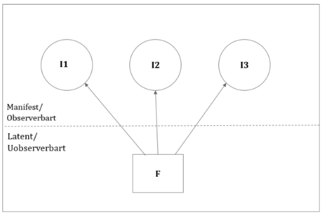
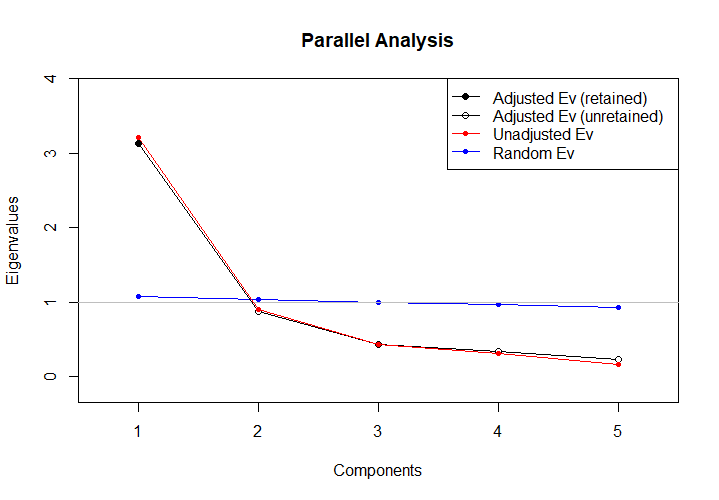

```{r echo=FALSE}

pacman:: p_load(dplyr, tidyverse, xaringanthemer,xaringanExtra, haven, paran, knitr, rayshader, av, psych, factoextra, usethis)


setwd("C:/Users/mmn/ROCKWOOL Foundation Dropbox/Mikkeline Munk Nielsen/Nyere statistiske analysestrategier F23/slides-mmn/NSA23")

#xaringan::inf_mr()

xaringanExtra::use_xaringan_extra(c("tile_view", "tachyons"))
xaringanExtra::use_panelset()


xaringanExtra::use_logo(
  image_url = "https://designguide.ku.dk/download/co-branding/ku_co_uk_h.jpg",
  width = "220px",
  height = "256px",
)


style_mono_light(base_color = "#8B0000")

style_mono_accent(
  base_color = "#8B0000",
  header_color = "#8B0000",
  text_font_size = "1.2rem" 
)


```
---
# PCA forløbet

**PCA 1: Introduktion**
  + Introduktion til faktoranalyse, herunder PCA som vi skal arbejde med i praksis
  + Forudsætninger for PCA, faktorabilitet
  + Antal komponenter
  
--

**PCA 2: Faktor scores og rotation**

  + Næste step - hvordan fortolker vi de komponenter, som vi fandt sidst?
  + Rotation af komponenter (for en lettere fortolkning)
  
--

**PCA 3: Videregående analyser og øvelser**
  + Hvordan kan vi bruge vores komponenter i videre analyser?
  + Styr på PCA processen: øvelser i PCA fra start til slut på frisk data

--

**PCA 4:** 
  + Kort om andre typer af faktoranalyser + workshop med eksamensdata
  
---
# Program for i dag

- Introduktion til faktoranalyse generelt

- PCA intuition

- Maskinen bag PCA

- Forudsætninger for PCA

- Bestemmelse af antal komponenter (det kommer vi til)


---
# Introduktion til faktoranalyse og PCA

Faget fokuserer på PCA, som er den mest grundlæggende form for *eksporativ* faktoranalyse.

Faktoranalyser er dog en bred gren med mange teknikker - også konfirmative fremfor eksplorative.

Vi starter med en bred introduktion til faktoranalysen i sin helhed.

.pull-right[]
---
# Introduktion til faktoranalyse og PCA

.pull-left[
Faktoranalyse referer til en række af teknikker, der forsøger at **reducere variansen** i en korrelationsmatrice med mange (relaterede) variable til få grundlæggende variable

Wikipedia’s definition af faktoranalyse:<break>

*”Factor analysis is a statistical method used to describe variability among observed, correlated variables in terms of a potentially lower number of unobserved variables called factors.“ *
]
.pull-right[]
---

# Let's rewind!
**Hvad er forskellen på LCA og PCA?**
--

.pull-left[
**LCA** gruppérer **personer** i nogle få grundlæggende *typer/klasser* 
<break>

]

--
.pull-right[
**PCA** grupperer **variable** der måler det samme og omgrupperer dem til færre *nye variable*, der opsummerer variationen på tværs af de gamle variable


]

--

Faktoranalyse handler altså om at gruppere variable på baggrund af, om de i virkeligheden "måler det samme" og derfor "ligner hinanden".

---
# Historisk baggrund


.pull-left[
Personen bag faktoranalyse siges normalt at være statistikeren .link-style2[[Charles Spearman (1863-1945)](https://en.wikipedia.org/wiki/G_factor_(psychometrics)]


Spearman var optaget af ideen om G-faktoren, dvs. at en række menneskelige evner lader til at stamme fra en enkelt evne (**g**eneral intelligence).

”Kan man måle denne underliggende (og uobserverede) G-faktor?”

I faktoranalyse termer: hvilke konstrukter eller dimensioner står bag korrelationer mellem disse menneskelige evner?
]
.pull-right[


]

*(Kline 1994:7)*
---
# Faktoranalysen som målemodel
Faktoranalysen kan motiveres ud fra en målemodel (dog med modifikationer, som vi vender tilbage til)

.pull-left[

]

.pull-right[
Pilene i målemodellen siger noget om, hvordan den latente variable **F**, påvirker indikatorerne, **I**.

--

Der er en underliggende antagelse om, at de manifeste indikatorer er betinget uafhængige, givet den latente variabel.

--

Pilene svarer til det, vi i faktoranalyse kalder *factor loadings* (det vender vi tilbage til)
]
---
# Faktoranalysen som målemodel

- Hvor LCA er en personorienteret tilgang til data-mining, så er FA (herunder PCA) variabelorienteret.
--

- Med andre er ord handler det om at gruppere indikatorvariable på baggrund af, om de ”måler det samme” og derfor ”ligner hinanden”.
--

- LCA, derimod, handler om at gruppere personer på baggrund af, om personerne ligner hinanden…

---
# Skalakonstruktion

Man bruger blandt andet faktoranalysen til skalakonstruktion!

--

En skala er normalt defineret ved at være en (vægtet) sum af variable, der måler det samme underliggende koncept.Skalaen skulle gerne måle et underliggende fænomen eller teoretisk begreb, fx en grundholdning.

--

Det første vi kunne gøre var at kombinere de fem spørgsmål til en simpel sumskala:

$$S = I_i + I_2+I_3+I_4+I_5$$
--

Her antager vi, at hver variabel bidrager lige meget til det underliggende fænomen, som vi forsøger at måle.
---
# Skalakonstruktion

Alternativt kan vi begive os ud i at vægte spørgsmålene alt efter, hvilke spørgsmål der indeholder mest variation. I dette tilfælde begiver vi os ud i en vægtet sumskala.

Eksempel på en *vægtet* sumskala med 5 items:

$$S = 0.5*I_i + 0.9*I_2+1*I_3+0.7*I_4+0.5*I_5$$
---

# Skalakonstruktion

Alternativt kan vi begive os ud i at vægte spørgsmålene alt efter, hvilke spørgsmål der indeholder mest variation. I dette tilfælde begiver vi os ud i en vægtet sumskala.

Eksempel på en *vægtet* sumskala med 5 items:

$$S = 0.5*I_i + 0.9*I_2+1*I_3+0.7*I_4+0.5*I_5$$

**Summeøvelse i 2 min med sidemanden:** hvad er intuitionen i en vægtet sumskala? Hvad siger vægtene?

---

# Skalakonstruktion
Alternativt kan vi begive os ud i at vægte spørgsmålene alt efter, hvilke spørgsmål der indeholder mest variation. I dette tilfælde begiver vi os ud i en vægtet sumskala.

Eksempel på en *vægtet* sumskala med 5 items:

$$S = 0.5*I_i + 0.9*I_2+1*I_3+0.7*I_4+0.5*I_5$$

**Summeøvelse i 2 min med sidemanden:** hvad er intuitionen i en vægtet sumskala? Hvad siger vægtene?

*I en vægtet sumskala tildeles items forskellige vægt på baggrund af deres relevans. Det kan faktoranalysen hjælpe os med!*

Med andre ord kan faktoranalyseen hjælpe os med at afgøre, hvilke variable der skal tildeles den største vægt til hvert komponent (nye variabel).
---
# Faktoranalyse som målemodel

**Fiktivt eksempel:**


- Vi har stillet en gruppe af unge 5 forskellige spørgsmål om deres selværd målt på en skala fra 0-100
--
- Målet er at måle deres *overordnede* selvværd, dvs. et *latent* fænomen, som vi tror på "styrer" deres svar på de 5 spørgsmål
--
- Vi kan bruge faktoranalysetil at konstruere et nyt mål for overordnet selvværd, baseret på deres svar på de forskellige spørgsmål.

---
# Faktoranalyse som målemodel

Faktoranalyse kan faktisk forstås ud fra linear regression.

.pull-left[
"Modellen" er:
$$I_1=\beta_1F+\epsilon_1$$
$$I_2=\beta_2F+\epsilon_2$$
$$I_3=\beta_3F+\epsilon_3$$
]
.pull-right[
Beta-koefficienterne siger noget om, hvor *stærkt* F påvirker responser på indikatorerne.

Betinget uafhængighed betyder, at:
$$corr(\epsilon_1, \epsilon_2, \epsilon_3)=0$$
]

---
# Faktoranalyse kan bruges til...


- At vurdere om det giver mening at lægge variable sammen i én skala

--

- At tildele vægte til den "vægtede" sumskala - indikatorer, der er særlig konstitutiv for den latente variabel, bliver tildelt størst vægt

--

- Skalavalidering (særligt CFA)

--

- Identificere om et konstrukt/begreb er en- eller flerdimensionelt. Er solidatitet f.eks. en- eller todimensionelt?

---
# Der er flere typer af faktoranalyser...

Faktoranalyse dækker over både eksplorative og konfirmative teknikker

--

.pull-left[
**Eksplorativ Ffaktoranalyse (EFA)**
- Principal component analysis (PCA) 
- Common factor model (CFM)
]

--


.pull-right[
**Konfirmativ (CFA)**
- Konfirmativ faktoranalyse
]

--

EFA, hvor PCA er den fundamentale teknik, gør sig i princippet ingen antagelser om, hvordan de underliggende variable ser ud (eller hvor mange der er). Er *ikke* modelbaseret.

--

CFA antager på baggrund af teori, hvad de latente variable *bør* måle. *Er* modelbaseret. 


---
# Der er flere typer af faktoranalyser...

**Fokus i dette kursus er på PCA!**

Hvorfor? Fordi kurset handler om data-mining, og fordi det er langt mere praktisk og intuitivt end CFA. Hvis vi får tid berører vi overfladisk CFA, når vi ser på noget af det videregående.

--

Eksplorativ faktoranalyse referer til ikke-modelbaseret faktoranalyse


***I virkeligheden er der to tilgange...***

--

- Principal component analysis (PCA)

--

- Common faktor model (CFM)


---
# PCA vs. CFM

PCA er en statistisk metode, der transfomerer en korrelationsmatrix med ***mange*** indikatorvariable til relativt ***få variable***, der er ukorrelerede med hinanden, og som kan forklare den variation, som indikatorvariablene deler. 

--

PCA kan med andre ord reducere dimensionaliteten i vores data!

--

.pull-left[
*Intuitionen er: PCA sorterer i den variation, som en række manifeste indikatorer deler, og opsummerer den i et et lavere antal nye variable*
]

.pull-right[

]

---
# PCA vs. CFM

CFM baserer sig på samme statistiske teknik som PCA, men antager, at de latente variable (faktorerne) er hypotetiske konstrukter, ikke "virkelige" faktorer.

--

- Forskellen er, at CFM antager, at de latente variable ikke kan forklare *al* variationen i korrelationsmatricen. Det gør PCA derimod (rå datamining)

--

- CFM er altså ikke en deterministisk model; den tager højde for tilfældig støj (unik varians vs. error varians).

--

- Selvom distinktionen er vigtig at forestå, fokuserer kurset på PCA. PCA er mere udbredt og nemmere at forstå (spoiler: i praksis vil de ofte producere samme resultat). Vi berører CFM i vores fjerde session.

--

> Forskellen på PCA og CFM er godt beskrevet i pensum (Kline 1994: kap. 4; Pett et al. 2003:102ff).

---
# Principal component analysis (PCA)

PCA er en statistisk metode, der transformerer en korrelationsmatrix med mange variable til få variable, der er ukorrelerede med hinanden.

Intuitionen: PCA sorterer i alt den variation,som en række manifeste indikatorer deler.
.pull-left[
***Vi kan altså bruge PCA til at reducere antallet af variable i vores data, som alligevel ser ud til at måle det samme***
]


     
---
# Principal component analysis (PCA)

Forestil jer en målemodel af følgende form: 
$$y_i = \beta_{1}I_{1i} + \beta_{2}I_{2i} + ... + \beta_{k}I_{ki}$$
--

PCA producerer nye komponenter/variable, som man kan tænke på som $y_i$ i modellen ovenfor. Disse komponenter konstrueres på baggrund af en vægtet sumskala af vores indikatorvariable (de ti spørgsmål). $\beta$-værdierne indikerer vægtene for hvert item. 

--

PCA vælger $\beta$-værdier sådan at $Var(y_i)\rightarrow \max$. Dvs den nye variabel indeholde så meget af variationen på tværs af indikatorvariablene som muligt! 

--

Med andre ord reducerer man antallet af variable til $i$ komponenter, der maksimerer variansen i de oprindelige variable. PCA tildeler vægte således, at de nye variable indeholder så meget information som muligt.   
---
# Principal component analysis (PCA)

.pull-left[

- Forestil jer to korrelerede variable, x og y, afbilledet i et scatterplot som dette. 


- PCA udregner komponenter ved at finde den linje, der bedst opsummerer den fælles variation mellem de manifeste variable. 


- De komponenter som PCA finder, er altså lineære kombinationer, af de originale variable.

]
.pull-right[

]


---
# Principal component analysis (PCA)

.left-column[

- Den maksimale varians og minimale målefejl findes samtidig, når den roterende linje når de magentafarvede linjer.


- PCA vil orientere sig mod denne linje for at maksimere varians!
]

.right-column[

```{r, echo = FALSE, out.width='100%'}
knitr::include_graphics('https://i.stack.imgur.com/Q7HIP.gif')
```

.center[.backgrnote[Source: ["amoeba" on Stackexchange](https://stats.stackexchange.com/questions/2691/making-sense-of-principal-component-analysis-eigenvectors-eigenvalues/2700)]]
]

---
# Principal component analysis (PCA)

.pull-left[

- Tingene bliver mere uoverskuelige, når vi har at gøre med flere dimensioner...

- Så snart vi kommer over tre dimensioer(variable i matricen), kan vi ikke længere tegne det.

- Men PCA er bygget til at finde mønstre i multidimensionelle rum!

]

.pull-right[
```{r echo=F}

library(scatterplot3d)

set.seed(10)
x <- rnorm(1000)
y <- x+ rnorm(1000)
z <- rnorm(1000)

scatterplot3d(x, y, z, pch = 19, color = "blue")

```
]


---
# PCA step-by-step

**1. Teori + operationalisering (variabeludvælgelse)**
+ Udvælg indikatorer, som man med rimelighed vil forvente måler det, I gerne vil måle.

+ Motivation: Hvilke variable tror jeg ”måler det samme”?

+ Eller: Består et begrebet af en eller to dimensioner? <break>

--

**2. Identificer antallet af faktorer**
+ Hvordan man gør det i praksis, vender vil tilbage til… <break>

--

**3. Roter dine faktorer (!)**
+ En operation, der gør dine factor loadings fortolkelige (vender vi også tilbage til)<break>

---
# PCA step-by-step

**4. Beskriv dine resultater**
- med udgangspunkt i de roterede factor loadings. Psst... Factor loadings svarer lidt til rho-parametre i LCA

--

**5. Beskriv dine resultater**
+ Brug de nye variable/komponenter i videre analyser. Er der kønsforskelle i institutionel tillid?
Eller konstruér simple skalaer/indeks med udgangspunkt i din faktoranalyses resultater og brug disse skalaer i videre forskning.

---
# Eksempel 

Lad os prøve at se på et eksempel fra European social survey omkring generaliseret tillid. Survyen indeholder fem spørgsmål (items/variable), som spørger ind til borgernes tillid til en række samfundsmæssige institutioner:
<break>

**1** `parliament = Trust in parliament`, 

**2** `legal_system = Trust in the legal system` 

**3** `police = Trust in the police`

**4** `politicians = Trust in politicians`

**5** `parties = Trust in parties` 

.pull-right[
*Skala: 0 (no trust at all) - 10 (complete trust)*
]

---
# Eksempel

```{r, include=FALSE}

# Read dataset (for now as dta file, which Haven can help with)

ESS_DK <- read_dta("C:/Users/mmn/ROCKWOOL Foundation Dropbox/Mikkeline Munk Nielsen/Nyere statistiske analysestrategier F23/slides-mmn/NSA23/ESS6DK.dta")

ESS_DK <- ESS_DK %>%
  zap_labels() %>% 
  transmute(
    #Openness indicators (coding missing values):
    parliament = if_else(trstprl %in% c(88:99), NA_real_, trstprl),
    legal_system = if_else(trstlgl %in% c(88:99), NA_real_, trstlgl),
    police = if_else(trstplc %in% c(88:99), NA_real_, trstplc),
    politicians = if_else(trstplt %in% c(88:99), NA_real_, trstplt),
    parties = if_else(trstprt %in% c(88:99), NA_real_, trstprt),

    #Education variables:
    edu = case_when(
      edulvlb %in% c(8888:9999) ~ NA_real_,
      edulvlb %in% c(0:600) ~ 0,
      TRUE ~ 0,
      edulvlb %in% c(601:801) ~ 1,
      TRUE ~ 1)) %>%
  #Restricting sample to non-missing:
  drop_na()

```
Vi kan start med at undersøge korrelationsmatricen:
```{r echo=FALSE}

(ESS_DK %>% 
    dplyr::select(parliament, legal_system, police, politicians, 
                  parties) %>% 
    cor())


```
**2 min med sidemanden:** Undersøg korrelationsmatricen med din sidemakker. Hvad fortæller den os om sammenhængene mellem de fem items?

---
# Eksempel

Vi kan start med at undersøge korrelationsmatricen:
```{r echo=FALSE}

(X<- ESS_DK %>% 
    dplyr::select(parliament, legal_system, police, politicians, 
                  parties) %>% 
    cor())


```
**2 min med sidemanden:** Undersøg korrelationsmatricen med din sidemakker. Hvad fortæller den os om sammenhængene mellem de fem items?

Alle variable korrelerer positivt, dog med varierende styrke. 
Tillid til regeringen korrelerer f.eks. højt med tillid til politikere og politiske partier, men kun moderat med tillid til politiet.

*Nu er spørgsmålet: kan matricen forklares af èn underliggende variabel, der kan siges at måle institutionel tillid som teoretisk begreb? Lad os prøve at køre en PCA og se ad!* 
---
# Principperne bag PCA

PCA forsøger at ”mine” korrelationsmatricen ved at se, om alle korrelationer kan forklares af en (lineær) kombination af underliggende, ukorrelerede nye variable kaldet ***komponenter*** 

**Det metodiske princip i PCA er følgende:**

--

**1)** Identificer den første komponent, der forklarer så meget fællesvariation som muligt i korrelationsmatricen.

--

**2)** Find da den anden komponent, der forklarer så meget som muligt af den fællesvariation, der er tilbage i matricen efter man har trukket den første komponent ud!

--

**3)** Fortsæt som i punkt 2 indtil der ikke er mere fællesvariation at forklare.

---
# Principperne bag PCA

- Det helt centrale i PCA-metoden er, at man udtrækker eller fjerner den forrige komponent før man identificerer den næste komponent. 

--

- Der foregår altså en løbende ”residualisering” af korrelationsmatricen.
Det er det samme som at sige, at komponenterne er ukorrelerede med hinanden. De er en ”lineær kombination af ortogonale variable”.

--

- Dette princip i PCA betyder også, at den første komponent altid er den komponent, der forklarer mest variation, den anden næstmest, osv.…
---
# Principperne bag PCA

- PCA er kendetegnet ved, at den fortsætter med at finde komponenter ind til al variation i korrelationsmatricen er forklaret.

--

- Det betyder også, at PCA altid finder lige så mange komponenter, som der er indikatorvariable!
Her adskiller PCA sig fra CFM – CFM antager, at man ikke kan forklare al variation…

--

**Og bemærk…**

--

PCA er ikke modelbaseret – det er bare en ***iterativ*** statistisk metode, som ***dekomponerer*** korrelationsmatricer vha. ortogonale transformationer.

---
# Bare rolig...

.pull-left[
I skal ikke kunne eller gennemgå de matematiske principper bag PCA til eksamen.

Men det kan være fint at forstå, at det ikke er sort magi, der producerer jeres resultater.

Derfor gennemgår vi lige de grundlæggende processer, der ligger til grund for at PCA...
]

.pull-right[
```{r, echo = FALSE, out.width='70%'}
knitr::include_graphics('https://media.tenor.com/xJfQQ-t9u3oAAAAM/success-kid-hells-yes.gif')
```
]


---
# I PCA maskinrummet
PCA baserer sig på eigenvalue decompositions, dvs. dekompositioner af en korrelationsmatrice ud i dens egenværdier og egenvektorer.

--

**1)** Egenværdier: en enkelt værdi, $\lambda$, der representerer, hvor stor en andel af variansen i de oprindelige items, som kan forklares af en given komponent (eller faktor).

--

**2)** Egenvektorer er kollonner af ***vægte***, der hver er associeret med et item i korrelationsmatricen (jvf. vores snak om vægtede sumskalaer). Det er fra egenvektorerne, at vi udregner *factor loadings*, der representerer korrelationen mellem hvert originale item og nye komponent. 


---
# I PCA maskinrummet
PCA udtrækker komponenter fra korrelationsmatricen via. en iterativ (gentagende) process, der går ud på at finde en passende egenvektor og egenværdi til at udregne factor loadings for en komponent. 

--

- Den første komponent, $PC_1$, er en lineær kombination af de originale items, der forklarer den maksimale andel af variansen blandt variablene. 

--

- Egenværdien for $PC_1$, $\lambda_1$, repræsenterer, hvor meget af variansen i korrelationsmatricen $PC_1$ forklarer. Den er givet ved summen af kvarderede factorloadings for komponenten.

--

- Factor loadings (som findes på bagrgund af egenvektorer og egenværdier) representerer korrelationen mellem hvert item i korrelationsmatricen med og komponenterne (det arbejder vi med næste gang)

---
# I PCA maskinrummet
Komponent nummer to, $PC_2$, findes på nøjagtig samme måde... **MEN!**

--

- Forskellen er, at $PC_2$ ikke findes udtrækkes fra den originale korrelationsmatrice, men fra en *residualmatrice*, hvor effekten af det første komponent allerede er udtrukket. 

--

- Fordi indflydelsen fra $PC_1$ allerede er taget ud,er $PC_2$ ukorreleret (othogonal) med $PC_1$, og forklarer dermed *anden-mest* variation, der er tilbage after at have udtrukket første komkponent. 

--

- Egenværdien for anden komponent, $\lambda_2$, er derfor nødvendigvis den anden-største egenværdi

--

Processen med at udtrække komponenter fortsættes på de efterfølgende residualmatricer indtil elementerne i residual varians-covarians matricen er reduceret til tilfældig støj. 

--

Hver komponent er orthogonal til de andre og opsummerer den maksimale varians der er tilbage, efter at de forrige komponenter er udtrukket. Derfor vil første komponent forklare mest og sidst mindst.


---
# I PCA maskinrummet
Lad os prøve at se, hvordan PCA udregner disse komponenter...


PCA starter med korrelationsmatricen:
```{r echo=FALSE}

U_a1 <- colSums(X)
X <- rbind(X, c(3.336918,3.083289,2.689348,3.418649,3.340383))

rownames(X)<- c("parliament", "legal_system", "police", "politicians", "parties", "Sum")

X  
  
```
** Step 1** sum korrelationskoeficienterne i hvert kolonne. Disse værdier udgør en vector $U_{a1}$

--

Altså er $U_{a1}=[3.336918,3.083289,2.689348,3.418649,3.340383]$
---
# I PCA maskinrummet

** Step 2** Normalisér $U_{a1}$ ved at kvardrere og addere summen af kollonnerne i $U_{a1}$. Divider så hvert element med kvadratroden af summen af kvardraterne. Resultatet bliver den første "trial vector" $V_{a1}$.

--

Dvs. hvis $U_{a1}=[3.34,3.08,2.69,3.42,3.34]$

--

Så er $U_{a1}^2=[11.14, 9.51, 7.24, 11.69, 11.16]$
```{r include=FALSE}

U_a1_2 = U_a1^2
sum(U_a1_2)

sqrt(sum(U_a1_2))

(V_a1 <- U_a1/sqrt(sum(U_a1_2)))
```

--

Summen af $U_{a1}^2 = 50.72$

--

Dernæst finder vi kvardratroden $\sqrt{50.72} = 7.12$ 

--

For at finde $V_{a1}$ normaliserer vi nu $U_{a1}$ ved at dividere elementerne med $7.12$. Vores første trial vector er således:

--

$V_{a1}=[0.47, 0.43, 0.38, 0.48, 0.47]$

---
# I PCA maskinrummet

** Step 3** Find den anden trial vector

--

Elementerne i $V_{a1}$ ganges akkumuleret med værdierne fra første række i korrelationsmatricen, for at finde første element i en ny vektor, $U_{a2}$:

```{r echo=FALSE}
(X)
```
```{r include=FALSE}
(0.4685518*1)+(0.4329386*0.5584236)+(0.3776236*0.3784972)+(0.4800280*0.7224152)+(0.4690383*0.6775825)
(0.47*0.56)+(0.43*1)+(0.38*0.58)+(0.48*0.48)+(0.47*0.46)
```

--

$V_{a1}=[0.47, 0.43, 0.38, 0.48, 0.47]$

--

Første element: $0.47*1 + 0.43*0.56 + 0.38*0.38 + 0.48*0.72 + 0.47*0.68 = 1.52$

--

Andet element: $0.47*0.56+ 0.43*1 + 0.38*0.58 + 0.48*0.48 + 0.47*0.46 = 1.36$

... til vi har fem elementer (tænk på matricens dimensioner)

---
# I PCA maskinrummet

** Step 3 (fortsat)** Find den anden trial vector
```{r include=FALSE}
(0.4685518*1)+(0.4329386*0.5584236)+(0.3776236*0.3784972)+(0.4800280*0.7224152)+(0.4690383*0.6775825)
(0.47*0.56)+(0.43*1)+(0.38*0.58)+(0.48*0.48)+(0.47*0.46)
(0.47*0.3784972)+(0.43*0.5763997)+(0.38*1)+(0.48*0.3742397)+(0.47*0.3602119)
(0.47*0.7224152)+(0.43*0.4839359)+(0.38*0.3742397)+(0.48*1)+(0.47*0.8380581)
(0.47*0.6775825)+(0.43*0.4645301)+(0.38*0.3602119)+(0.48*0.8380581)+(0.47*1)


U_a2 = c(1.52,1.36,1.15,1.56,1.53)

U_a2_2 = U_a2^2

sum(U_a2_2)


sqrt(sum(U_a2_2))

V_a1=U_a2/sqrt(sum(U_a2_2))

```

Første element: $0.47*1.00 + 0.43*0.56 + 0.38*0.38 + 0.48*0.72 + 0.47*0.68 = 1.52$

Andet element: $0.47*0.56+ 0.43*1.00 + 0.38*0.58 + 0.48*0.48 + 0.47*0.46 = 1.36$

Tredje element: $0.47*0.38+0.43*0.58+0.38*1.00+0.48*0.37+0.47*0.36 = 1.15$

Fjerde element: $0.47*0.72+0.43*0.48+0.38*0.37+0.48*1.00+0.47*0.84 = 1.56$

Femte element: $0.47*0.68+0.43*0.46+0.38*0.36+0.48*0.84+0.47*1.00 = 1.53$

--

.pull-left[

Dvs at: 

$U_{a2} = [1.52,1.36,1.15,1.56,1.53]$, og 

$U_{a2}^2 = [2.31, 1.85, 1.32, 2.43, 2.34]$  

]

---
# I PCA maskinrummet

** Step 4** Normaliserer $U_{a2}$ præcis som med $U_{a1}$:

--

Summen af $U_{a2}^2= 10.257$ 

--

og $\sqrt{10.257} = 3.2$ 

--

Hvert element i $U_{a1}$ divideres nu med $3.2$, dvs $\sqrt{\sum_{U_{a2}^2}}$, hvilket giver os den anden trial vector:

--

$V_{a2}=[0.47, 0.42, 0.36, 0.49, 0.48]$

---
# I PCA maskinrummet

**Step 5** Sammenlign de to trial vectors:

$V_{a1}=[0.47, 0.43, 0.38, 0.48, 0.47]$

$V_{a2}=[0.47, 0.42, 0.36, 0.49, 0.48]$

--

PCA fortsætter med at producere og sammenligne trial vectors indtil de "konvergerer", dvs. indtil de er så godt som ens (Kline skriver at kriteriet for konvergens er, at summen at de kvardrerede forskelle mellem de parvise elementer er < 0.00001). 

--

Vores trial vectors er således ikke tilfredsstillende endnu. Hvis vi forestiller os, at der opnås konvergens mellem trial vector $V_{a4}$ og $V_{a3}$, vil $V_{a3}$ blive den første **egenvektor**. Den kunne tage følgende værdier:

```{r include=FALSE}


pca <- (ESS_DK %>% 
          dplyr::select(parliament, legal_system, police, politicians, 
                  parties) %>% 
          prcomp(center=TRUE, scale=TRUE))

PC1 <- pca$rotation[,1]


```

$V_a = [0.48, 0.42, 0.35, 0.49, 0.48]$

---
# I PCA maskinrummet

**Vi har nu fundet den første egenvektor!**

--

Vi finder den første egenværdi $\lambda_1$ ved at tage kvardratroden af kvardratsummen i den fjerde trial vector $U_{a4}$

--

*Denne process fortsættes indtil alle elementerne er udtrukket...*

--

De følgene komponenter udtrækkes dog på baggrund af *residualmatricen* fremfor en originale korrelationsmatrice. 

---
# I PCA maskinrummet

***Residualmatricen*** findes ved at finde de parvise produkter af faktorloadings for alle items fra sidste komponent og trække dem fra den originale korrelationsmatrice, element for element. 

--

*Det er en del kombinationer, så vi gider ikke gøre det her (se evt. Kline 1994:33-34).*

--
.pull-left[
Herfra gentages processen med at udtrække trial vectors (dog nu fra residualmatricen) indtil de konvergerer og man har lige så mange komponenter, som man har originale variable. 
]

.pull-right[


]

---
# PCA i praksis...

Som I kan se er PCA egentlig ikke en særlig kompliceret operation, der er bare tung i udregninger. Det er fordi, at vi lige har lavet data-mining i hånden. 

--

Heldigvis har I lært at kode i R. Med andre ord behøver I aldrig at gøre det her igen... I skal bare gøre sådan her:

--

```{r, echo=TRUE}
(pca <- (ESS_DK %>% 
          dplyr::select(parliament, legal_system, police, politicians, 
                  parties) %>% 
          prcomp(center=TRUE, scale=TRUE)))

```
---
# PCA i praksis
Komponenternes standardafvigelser (SD) fortæller os om vigtigheden at hvert komponent.
```{r, echo=TRUE}
summary(pca)
```

--

Hvis vi kvardrerer dem, får vi de såkaldte eigenværdier!
```{r, echo=TRUE}
(pca$eigen_values <- pca$sdev^2)

```
---
# PCA i praksis

Egenværdierne repræsenterer som sagt komponenternes forklaringskraft. Hvis vi deler egenværdierne med antallet af komponenter, får vi andelen af variationen i den originale korrelationsmatrice, som hvert komponenten forklarer
```{r, echo=TRUE}
(pca$prop_var <- pca$eigen_values/5)
```

--

Dette fremgår også af outputtet fra summary funktionen
```{r echo=FALSE}
summary(pca)
```

--

**2 min med sidemanden** Hvad betyder "Cumulative Proportion" og hvorfor giver det mening, at de fem komopnenter summer til 100? 

---
# Kort opsummering

- PCA er en statistisk metode, der transformerer en korrelationsmatrice med mange (korrelerede) variable til få variable, der er ukorrelerede med hinanden 

--

- PCA forsøger at ”mine” denne korrelationsmatrice ved at se, om alle korrelationer kan forklares af en (lineær) kombination af underliggende, ukorrelerede variable kaldet komponenter.

--

- PCA baserer sig på eigenvalue decompositions, dvs. dekompositioner af korrelationsmatricen ud i dens egenværdier og egenvektorer.

--

  + ***Egenværdier*** repræsenterer komponenternes forklaringskraft, dsv. hvor meget af variationen i korrelationsmatricen, som en komponent fanger

  + ***Egenvektorer*** er kollonner af vægte, der beskriver sammenhængen mellem de originale items og nye komponenter. Vi bruger dem til at fortolke betydningen af komponenterne (næste gang)


---
# Kort opsummering

- Resultatet er en række nye variable (komponenter), hvoraf det første opsummerer den største andel af den originale varians, den næste næstmest osv. 

--

- Vi kan altså bruge PCA til at opsummere variansen blandt en række originale items i et mindre antal orthogonale variable, der er lineære kombinationer af de originale.

---
# Forudsætninger for PCA

Forudsætningen for PCA er, at de variable vi fodrer analysen faktisk korrelerer. 

--

&rarr; Dette afgør vi først og fremmest teoretisk!

--

- Men, lærebøger (fx Hansen 2017 eller Pett et al.-bogen) fremhæver typisk, at man skal undersøge sin korrelationsmatrice, inden man går i gang med en PCA (eller anden EFA).

--

- Spørgsmålet er, om indikatorvariablene deler nok variation til at det giver mening at kombinere dem. Sagt på en anden måde: *er korrelationsmatricen **”faktorabel”**?*

--

*Vi kan godt være lidt skeptiske overfor formelle regler for, hvornår en matrice er faktorabel – men det er altid godt at tjekke sine data, inden man går videre i analyserne! *
---
# Forudsætninger for PCA
Hansen (2017) siger, at hver indikatorvariabel i en korrelationsmatrix skal have mindst en korrelation på over 0,3.

--

Hvis dette ikke er tilfældet, vil item’et sjældent kunne bidrage til at fortolke faktorerne.

--

Disse items kan enten fjernes, eller man kan begrunde at tage dem med ud fra teoretiske argumenter og så være særlig opmærksomme på dem i analysen.

--

** 2 min med sidemanden: opfylder korrelationsmatricen fra før denne betingelse?**
```{r echo=FALSE}

(ESS_DK %>% 
    dplyr::select(parliament, legal_system, police, politicians, 
                  parties) %>% 
    cor())
```
---
# Forudsætninger for PCA


Pett et al. fremhæver to formelle tests:

--

**1)** Kaiser-Meyer-Olkin test (KMO)

--

**2)** Bartlett’s (sfæriske) test

--

- Disse tests siger noget om, hvor velegnet en korrelationsmatrice er til PCA (og FA generelt).

--

- De skal og bør bruges heuristisk – ofte er teoretiske argumenter for medtagelse af indikatorer lige så centrale, hvis ikke vigtigere!

--

- Men, de to formelle tests kan bruges til at rette sin opmærksomhed mod nogle specifikke items, der måske opfører sig anderledes end ventet.

---
# KMO

- Undersøger korrelationer parvist og sammenligner dem med de partielle korrelationer (når der kontrolleres for øvrige items).

--

- Hvis items er en funktion af underliggende faktorer, vil partielle korrelationer være små sammenlignet med ujusterede korrelationer.

--

- Ved værdier over 0,8 anses matricen for at være tilstrækkelig faktorabel. 

--

```{r echo=TRUE, message=FALSE, warning=FALSE}

library(psych) # library der indeholder KMO-funktion og funktion til bartletts-test
(ESS_DK %>% 
    dplyr::select(parliament, legal_system, police, politicians, parties) %>% 
    KMO()) # KMO funktion
```

---
# Bartlett’s (sfæriske) test

- Tester om korrelationsmatricen er en såkaldt ”identitetsmatrix”, hvilket er ensbetydende med, at alle variable er ukorrelerede. 

--

- Små p-værdier (under 0,05) indikerer, at matricen er velegnet til faktoranalyse (forkaster H0, som er uafhængighed).

--

```{r echo=TRUE, message=FALSE, warning=FALSE}
(ESS_DK %>% 
    dplyr::select(parliament, legal_system, police, politicians, parties) %>% 
    cortest.bartlett(n=1406)) # KMO funktion, argument n= antal observationer
```

---
# Hvor mange komponenter?

Vi så lige før, at PCA producerer lige så mange komponenter som der er indikatorvariable. Men da hele pointen med PCA er at reducere antallet af variable, hvordan ved vi så, hvor mange vi skal beholde?

.pull-left[
I modsætning til LCA, er der ikke noget modelbaseret svar i PCA.

Derfor bruger man en eller flere selektionsregler, dvs. nogle principper for, hvor mange komponenter, man skal fastholde.
]


.pull-right[
```{r, echo = FALSE, out.width='55%'}
knitr::include_graphics('https://encrypted-tbn0.gstatic.com/images?q=tbn:ANd9GcTb9alKsnNOkFBmF7QGXv-_9zUQg85duotwDA&usqp=CAU
')
```
]


---
# Hvor mange komponenter?

Litteraturen fremhæver tre selektionsregler:

--

**1)** Egenværdier > 1 (Kaiser-Guttman kriteriet).

--

**2)** Cattell’s scree test (scree plot).

--

**3)** Parallel analysis (de facto standard i dag).

--

Bemærk: Pett et al. fremhæver kun 1+2, da 3 er relativt ny. Hayton et al. (2004) beskriver meget fint 3.

---
# Hvor mange komponenter?

** Kaiser-Guttman kriteriet: behold eigenværdier > 1**

--

- Rationale: Egenværdier større end 1 indikerer, at komponenten kan forklare mere end, hvad én indikatorvariabel kan forklare (og det giver jo ikke mening at beholde noget, der forklarer mindre end de oprindelige variable...)

--

```{r}
(pca$eigen_values) # print eigenværdier
```

--

Ulemper ved Kaiser-Guttman kriteriet: 

--

- Tendens til at overestimere antal reelle faktorer… 

--

- Arbitrært at skelne lige ved 1: hvad hvis man har eigenværdier på 0.98 or 1.01? 

---
# Screeplot

Scree test / scree plot: grafisk vurdering af trenden i egenværdier.

--

Også kendt som the elbow test: Dér hvor grafen – eller albuen – ”knækker” er det optimale antal komponenter. Og selve ”albuen” tælles med…

--

***Rationale:*** 
Få, store komponenter vil forklare en større del af variansen, efterfulgt af en række mindre betydelige komponenter. Vi er kun interesseret i de vigtigste komponenter.  

--

```{r include=TRUE, eval=FALSE}
# Visualize PCA object
fviz_eig(pca) 
```

---
# Screeplot

.center[]
---
# Screeplot

Bemærk!

--

- Elbow-kriteriet for scree-plottet har også ændret sig. Det skriver Pett et al. om.

--

- Man kan tegne en linje gennem de punkter, der ser tilnærmelsesvist lineære ud, og så bruge denne linjes skæring med eigenvalue-kurven som kriterie for udvælgelse. 

--

- Scree plotets ulempe er, at det har tendens til at overestimere antal faktorer…
Nogle gange er der ikke et tydeligt knæk, hvilket lægger op til fortolkning ...


---
#Parallel analysis

***Simulationsbaseret teknik***

--

**Rationale** Hvis vores PCA reelt fanger underliggende komponenter i vores items, bør vores komponenters egenværdier være højere, end hvis vi udførte en PCA i et sammenligneligt datasæt (samme stikprøvestørrelse og antal variable) på items som er ukorrelerede. 

--

- Man simulerer et nyt datasæt med: 

  + samme antal observationer
  + samme antal variable, men hvor
  + variablene er ukorrelerede med hinanden.
  
--  
  
- Man kører en PCA på de simulerede data og laver et scree-plot.Herefter kører man en PCA på de ”ægte” data, laver et scree-plot, og ”lægger” plottet ned over det simulerede plot.

--

- Antallet af signifikante komponenter er de komponenter, der ligger over skæringspunktet mellem de to kurver.

---
#Parallel analysis


```{r eval=FALSE}
library(paran)
(ESS_DK %>% 
  dplyr::select(parliament, legal_system, police, politicians, parties) %>% 
  paran(graph=T))
```

---
# Hvor mange komponenter?

.center[

]
** Parallel analysis: simulationsbaseret teknik**

---
# Øvelsestid


I skal nu lave jeres første øvelse i PCA!

- Vi skal arbejde med første del af ***Øvelse PCA-1 Børn er forskellige***

--

- I dag fokuserer vi på at reducere dimensionaliteten i vores data ved at udlede komponenter og bestemme, hvor mange komponenter, som vi skal beholde. 

--

- I skal arbejde med et datasæt med 25 variable, der relaterer sig til børn trivsel og adfærd. Spørgsmålet er, om de karakteristika, som de 25 variable måler, kan opsummeres i et lavere antal grundlæggende variable/dimensioner af adfærd.

--

- Opgaven er tilgængelig på *Absalon &rarr; assignments &rarr; Øvelse PCA-1 Børn er forskellige*

--

- **OBS!** Vi laver kun "til og med "first step" i dag. Næste uge går vi videre.

--

- Vi samler op i fællesskab. 


---
# Børn er forskellige...

De 25 spørgsmål stammer faktisk fra et måleinstrument, der hedder ***Strength and difficulties questionaire (SDQ)***

--

- Det er et kort spørgeskema, der belyser børns og unges psykiske trivsel og funktion i dagligdagen

--

- Spørgsmålene falder ind under fem subskalaer

--
  
  + Emotionelle symptomer
  + Adfærdsproblems
  + Hyperaktivitet
  + Peer problems (sociale vanskeligheder)
  + Pro-social adfærd

--

- Sammenfaldende at PCA'en finder fem komponenter! Eller måske ikke... 

--

Næste gang skal vi arbejder videre med, hvad de komponenter, som vi har udledt i dag indeholder!


