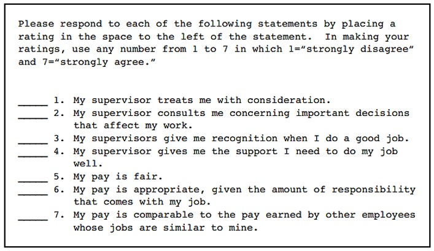

```{r echo=FALSE}

pacman:: p_load(dplyr, tidyverse, xaringanthemer,xaringanExtra, haven, paran, knitr, rayshader, av, psych, factoextra, usethis)


setwd("C:/Users/mmn/ROCKWOOL Foundation Dropbox/Mikkeline Munk Nielsen/Nyere statistiske analysestrategier F23/slides-mmn/NSA23")

#xaringan::inf_mr()

xaringanExtra::use_xaringan_extra(c("tile_view", "tachyons"))
xaringanExtra::use_panelset()


xaringanExtra::use_logo(
  image_url = "https://designguide.ku.dk/download/co-branding/ku_co_uk_h.jpg",
  width = "220px",
  height = "256px",
)


style_mono_light(base_color = "#8B0000")

style_mono_accent(
  base_color = "#8B0000",
  header_color = "#8B0000",
  text_font_size = "1.2rem" 
)


```

# Program for i dag

- Recap

  + PCA principper
  
  + Faktorabilitet
  
  + Antal komponenter
  
  + Egenværdier og egenvektorer
  

- Fortolkning af komponenter

- Rotation


---
# PCA principper

- Måde hvorpå man kan reducere ”mange variable” til ”få variable” som opsummerer informationen i de ”mange variable”.

--

- Forsøger at reducere variansen i en korrelationsmatrice med mange variable til nogle få, grundlæggende variable.

--

- Praktisk til at måle et svært observerbare fænomener eller begreber, fx en grundholdning, tillid, personlighed.

--

- Kan hjælpe med at undersøge om et fænomen/begreb er en- eller flerdimensionelt. Er fx jobtilfredshed 1- eller 2-dimensionelt?

---
# Eksempel: jobtilfredshed

Hvordan måler vi jobtilfredshed? 

Nogle bud? 

Svært at observere – eller måle med ét spørgsmål

---
# Eksempel: jobtilfredshed

.center[

]
Hvis vi starter med at undersøge korrelationsmatricen ser vi, at der ser ud til at være to grupper af høje korrelationer mellem batteriets items.
---
# Eksempel: jobtilfredshed

.pull-left[

]

.pull-right[

]
---
# Eksempel: jobtilfredshed
.pull-left[

Hvis vi undersøger korrelationsmatricen kan vi altså se, at der ser ud til at være to grupper af høje korrelationer mellem batteriets items. 

Givet de items som hver gruppe bygger på, hvad kunne vi så tolke, at den hhv. blå og røde gruppe af varibale siger noget om?
]


.pull-right[

]
---
# PCA

PCA forsøger at ”mine” korrelationsmatricen ved at se, om alle korrelationer kan forklares af en (lineær) kombination af underliggende, ukorrelerede variable kaldet komponenter.

***Det metodiske princip i PCA er følgende:***

**1)** Identificer den første komponent, der forklarer så meget fællesvariation som muligt i korrelationsmatricen.

**2)** Find da den anden komponent, der forklarer så meget som muligt af fællesvariation, der er tilbage i matricen efter man har trukket den første komponent ud!

**3)** Fortsæt som i punkt 2 indtil der ikke er mere fællesvariation at forklare.

---
# PCA

**MEN!** 

Sidst gang lærte vi, at forudsætningen for PCA er, at der er høj korrelation mellem de items, som man kører PCA på. Korrelationsmatrien skal så at sige være ***faktorabel***.


- Underesøg korrelationer mellem variable: Hver indikatorvariabel i en korrelationsmatrice skal have mindst en korrelation på over 0,3 (Hansen 2017)


- Kaiser-Meyer-Olkin test (KMO)

- Bartlett’s (sfæriske) test


Disse tests siger noget om, hvor velegnet en korrelationsmatrice er til PCA (og FA generelt). Vi lærte dog også, at de skal og bør bruges heuristisk – ofte er teoretiske argumenter for medtagelse af indikatorer lige så centrale, hvis ikke vigtigere!

---

# PCA

Fordi PCA forklarer al fællesvariationen i korrelationsmatricen finder den altid lige så mange komponenter, som der er indikatorvariable!

Hvor mange komponenter beholder vi? Ofte vil en god PCA være kendetegnet ved, at den reducerer antallet af variable, men fastholder de komponenter forklarer en betydelig del af den samlede variation eigenvalues

***Litteraturen fremhæver tre selektionsregler:***

**1)** Egenværdier > 1 (Kaiser-Guttman kriteriet).

**2)** Cattell’s scree test (scree plot).

**3)** Parallel analysis (de facto standard i dag).

---
# PCA

Med andre ord lærte vi sidste gang:

**1)** At undersøge, om en korrelationsmatrice er faktorabel

**2)** At bestemme, hvor mange komponenter vi skal beholde


I dag skal vi se nærmere på komponenterne og lære at fortolke deres indhold.

---


