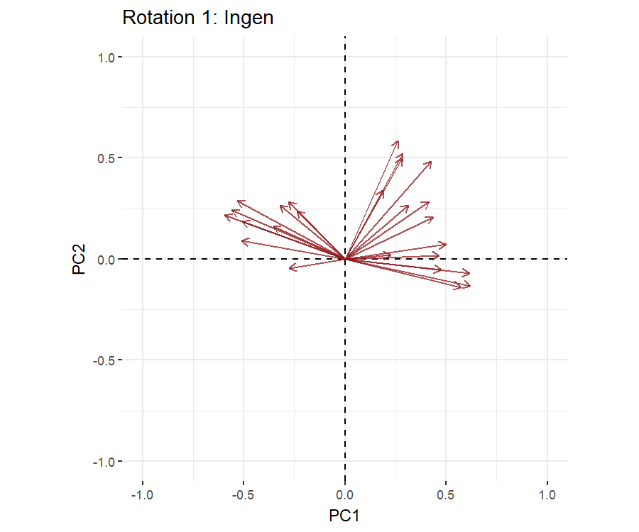

```{r echo=FALSE}

pacman:: p_load(dplyr, tidyverse, xaringanthemer,xaringanExtra, haven, paran, knitr, rayshader, av, psych, factoextra, usethis, stargazer)


setwd("C:/Users/mmn/ROCKWOOL Foundation Dropbox/Mikkeline Munk Nielsen/Nyere statistiske analysestrategier F23/slides-mmn/NSA23")

#xaringan::inf_mr()

xaringanExtra::use_xaringan_extra(c("tile_view", "tachyons"))
xaringanExtra::use_panelset()


xaringanExtra::use_logo(
  image_url = "https://designguide.ku.dk/download/co-branding/ku_co_uk_h.jpg",
  width = "220px",
  height = "256px",
)


style_mono_light(base_color = "#8B0000")

style_mono_accent(
  base_color = "#8B0000",
  header_color = "#8B0000",
  text_font_size = "1.2rem" 
)


```

# Program for i dag

- Recap

  + PCA principper
  
  + Faktorabilitet
  
  + Antal komponenter
  
  + Egenværdier og egenvektorer
  

- Fortolkning af komponenter - *factor loadings*

- Rotation

- Øvelser!


---
# Recap


Sidste gang lærte vi at

--

- PCA er en statistisk metode, der transformerer en korrelationsmatrice med mange (korrelerede) variable til få variable, der er ukorrelerede med hinanden 

--

- PCA forsøger at ”mine” denne korrelationsmatrice ved at se, om alle korrelationer kan forklares af en (lineær) kombination af underliggende, ukorrelerede variable kaldet komponenter.

--

- PCA baserer sig på eigenvalue decompositions, dvs. dekompositioner af korrelationsmatricen ud i dens egenværdier og egenvektorer.


---
# Recap

- Måde hvorpå man kan reducere ”mange variable” til ”få grundlæggende variable” som opsummerer informationen i de ”mange variable”.

--

- Praktisk til at måle et svært observerbare fænomener eller begreber, fx en grundholdning, tillid, personlighed.

--

- Kan hjælpe med at undersøge om et fænomen/begreb er en- eller flerdimensionelt. Er fx jobtilfredshed 1- eller 2-dimensionelt?

--

  + Hvordan måler vi jobtilfredshed? 

--
  
  + Svært at observere – eller måle med ét spørgsmål

---
# Eksempel: jobtilfredshed
  
.center[

]

---
# Eksempel: jobtilfredshed
  
.pull-left[
    
]

.pull-right[
  
]


---
# Eksempel: jobtilfredshed

.pull-left[
    
- Hvis vi undersøger korrelationsmatricen kan vi altså se, at der ser ud til at være to grupper af høje korrelationer mellem batteriets items. 
    
    
- Givet de items som hver gruppe bygger på, hvad kunne vi så tolke, at den hhv. blå og røde gruppe af varibale siger noget om?
]


.pull-right[
  
]

---
# Eksempel: jobtilfredshed

.pull-left[
    
- Hvis vi undersøger korrelationsmatricen kan vi altså se, at der ser ud til at være to grupper af høje korrelationer mellem batteriets items. 
    
    
- Givet de items som hver gruppe bygger på, hvad kunne vi så tolke, at den hhv. blå og røde gruppe af varibale siger noget om?
]


.pull-right[
  
]
---
# Recap


PCA forsøger at ”mine” korrelationsmatricen ved at se, om alle korrelationer kan forklares af en (lineær) kombination af underliggende, ukorrelerede variable kaldet komponenter.

--

***Det metodiske princip i PCA er følgende:***

--

**1)** Identificer den første komponent, der forklarer så meget fællesvariation som muligt i korrelationsmatricen.

--

**2)** Find da den anden komponent, der forklarer så meget som muligt af fællesvariation, der er tilbage i matricen efter man har trukket den første komponent ud!

--

**3)** Fortsæt som i punkt 2 indtil der ikke er mere fællesvariation at forklare.

---
# Recap

**MEN!** 

Sidst gang lærte vi, at forudsætningen for PCA er, at der er høj korrelation mellem de items, som man kører PCA på. Korrelationsmatrien skal så at sige være ***faktorabel***.

--

- Underesøg korrelationer mellem variable: Hver indikatorvariabel i en korrelationsmatrice skal have mindst en korrelation på over 0,3 (Hansen 2017)

--

- Kaiser-Meyer-Olkin test (KMO)

--

- Bartlett’s (sfæriske) test

--

Disse tests siger noget om, hvor velegnet en korrelationsmatrice er til PCA (og FA generelt). Vi lærte dog også, at de skal og bør bruges heuristisk – ofte er teoretiske argumenter for medtagelse af indikatorer lige så centrale, hvis ikke vigtigere!

---
# Recap 

Fordi PCA forklarer al fællesvariationen i korrelationsmatricen finder den altid lige så mange komponenter, som der er indikatorvariable!

--

*Hvor mange komponenter beholder vi?* Ofte vil en god PCA være kendetegnet ved, at den reducerer antallet af variable, men fastholder de komponenter forklarer en betydelig del af den samlede variation eigenvalues

--

***Litteraturen fremhæver tre selektionsregler:***

--

**1)** Egenværdier > 1 (Kaiser-Guttman kriteriet).

--

**2)** Cattell’s scree test (scree plot).

--

**3)** Parallel analysis (de facto standard i dag).

---
# Recap
Med andre ord lærte vi sidste gang:

**1)** At undersøge, om en korrelationsmatrice er faktorabel

**2)** At køre en pca i R

**3)** At bestemme, hvor mange komponenter vi skal beholde

--

*I dag skal vi se nærmere på komponenterne og lære at fortolke deres indhold.*

---
# PCA i praksis

Sidst arbejdede vi med eksemplet omkring institutionel tillid. Korrelationmatricen (5x5) så således ud:

```{r, include=FALSE}

# Read dataset (for now as dta file, which Haven can help with)

ESS_DK <- read_dta("C:/Users/mmn/ROCKWOOL Foundation Dropbox/Mikkeline Munk Nielsen/Nyere statistiske analysestrategier F23/slides-mmn/NSA23/ESS6DK.dta")

ESS_DK <- ESS_DK %>%
  zap_labels() %>% 
  transmute(
    #Openness indicators (coding missing values):
    parliament = if_else(trstprl %in% c(88:99), NA_real_, trstprl),
    legal_system = if_else(trstlgl %in% c(88:99), NA_real_, trstlgl),
    police = if_else(trstplc %in% c(88:99), NA_real_, trstplc),
    politicians = if_else(trstplt %in% c(88:99), NA_real_, trstplt),
    parties = if_else(trstprt %in% c(88:99), NA_real_, trstprt),

    #Education variables:
    edu = case_when(
      edulvlb %in% c(8888:9999) ~ NA_real_,
      edulvlb %in% c(0:600) ~ 0,
      TRUE ~ 0,
      edulvlb %in% c(601:801) ~ 1,
      TRUE ~ 1)) %>%
  #Restricting sample to non-missing:
  drop_na()


pca <- (ESS_DK %>% 
          dplyr::select(parliament, legal_system, police, politicians, 
                  parties) %>% 
          prcomp(center=TRUE, scale=TRUE))

```

```{r echo=FALSE}

(ESS_DK %>% 
    dplyr::select(parliament, legal_system, police, politicians, 
                  parties) %>% 
    cor())


```

Og vi kørte en PCA med **`prcomp()`** functionen
```{r, echo=TRUE}
pca <- (ESS_DK %>% 
          dplyr::select(parliament, legal_system, police, politicians, 
                  parties) %>% 
          prcomp(center=TRUE, scale=TRUE))
```

---
# PCA i praksis

**`Summary()`** funktionen gav os komponenternes standardafvigelser (SD), som fortæller os om vigtigheden at hvert komponent.
```{r, echo=TRUE}
summary(pca)
```

--

Hvis vi kvardrerer dem, får vi de såkaldte eigenværdier!
```{r, echo=TRUE}
(pca$eigen_values <- pca$sdev^2)

```

--

***Egenværdier*** repræsenterer komponenternes forklaringskraft, dsv. hvor meget af variationen i korrelationsmatricen, som en komponent fanger


---
# PCA i praksis

**`prcomp()`** outputtet gav os fem komponenter og deres tilhørende egenvektorer:
```{r, echo=TRUE}
pca
```

--

***Egenvektorer*** er kollonner af vægte, der beskriver sammenhængen mellem de originale items og nye komponenter.

--

I dag tager vi udgangspunkt i egenvektorerne, når vi skal vi arbejde med *factor loadings!*


---
# Factor loadings

**Definition**: *En factor loading er korrelationen mellem en komponent og en indikatorvariabel. Vi bruger dem til at fortolke komponenterne!*

--

Factor loadings kommer ud af den dekomposition, som PCAen laver:

--

  + ***Egenværdier*** repræsenterer komponenternes forklaringskraft, dsv. hvor meget af variationen i korrelationsmatricen, som en komponent fanger

--

  + ***Egenvektorer*** er kollonner af vægte, der beskriver sammenhængen mellem de originale items og nye komponenter. 

--

Factor loadings defineret som produktet mellem kvadratroden af egenværdien og en egenvektor

--

*(OBS: Det skal man ikke redegøre for til eksamen! Se Appendix E i Pett et al. (2003) eller Kline (1994) pp. 28-41)*

---
# Factor loadings

Vi kan udregne factor loadings og gemme dem i en matrice ved at gange kvardratroden af hver komponents egenværdi på komponentens egenvektor:

```{r echo=TRUE}
(pca$factor_loadings <- pca$rotation*t(matrix(rep(sqrt(pca$eigen_val),5),nrow=5,ncol=5))
) # Læg mærke til at jeg har specificeret matricens dimensioner (5x5) 
```
--

Disse tal repræsenterer korrelationen mellem de originale items og de nye komponenter/variable, som PCA'en producerer. 

---
# Factor loadings

Vi bruger factor loadings til at fortolke indholdet i de nye variable, som vi har konstrueret. 

```{r echo=FALSE}

(pca$factor_loadings) #Factor loadings

```

--

Fremgangsmåden er, at vi fortolker komponenterne på baggrund af, hvor højt de "loader" (eller korrelerer) med hver af de originale items. 

--

Eksemplet her viser, at alle indikatorerne loader forskelligt på de forskellige komponenter. Hvis vi fx antog, at der var 2 komponenter (dvs. to dimensioner i institutionel tillid), så kunne det tyde på, at 

--

**1)** den første komponent måler generel tillid.
  
--

**2)** den anden komponent måler tillid til retssystemet og politiet.

---
# Factor loadings

.pull-left[
```{r plot-pca, eval=FALSE, fig.show=F, include=FALSE}
# Visualize PCA object
fviz_pca_var(pca)
```
- Illustrationen viser de originale items placeret i et koordinatsystem med de to første komponenter

- Dette er de rå factor loadings... men det anbefales, at man ikke fortolker direkte på de rå... i stedet *roterer* man komponenterne, for at lette fortolkningen

]
.pull-right[
```{r ref.label = "plot-pca", echo = FALSE, out.width='100%', fig.height = 4, fig.width = 5}
```
]

---
# Rotation

- Formålet med rotation af faktorer er at opnå fortolkelige komponenter/faktorer, dvs. komponenter, hvor factor loadings relativt entydigt hjælper med at beskrive de nye variable.

--

***Hvorfor roterer vi??***

--

- Komponenter i en PCA udspænder et flerdimensionalt rum, hvori de manifeste variable er placeret. 

--

- Intuitionen er, at vi kan anskue det rum, som komponenterne udspænder, fra uendeligt mange vinkler.

--

- Factor loadings vil afhænge af, hvorfra man ser rummet (lidt forsimplet sagt).

--

- Rotation hjælper med at vælge en ”synsvinkel”, som giver en (mere) entydig fortolkning af komponenterne

---
# Rotation

.pull-left[

.center[**Uroteret**]
```{r ref.label = "plot-pca", echo = FALSE, out.width='90%', fig.height = 4, fig.width = 5}
```
]


```{r include=FALSE}
library(stargazer)
pca_2 <- varimax(pca$rotation[,1:2])
pca_2$loadings


# Visualize the first two ROTATED components and compare with visualizations from #2:
pca_orto1 <- pca
pca_orto1$rotation <- pca_2$loadings

```


```{r plot-pca-rot, eval=FALSE, fig.show="hide", warning=FALSE, include=FALSE}
# Visualize PCA object
fviz_pca_var(pca_orto1)
```

.pull-right[
.center[**Roteret**]

```{r ref.label = "plot-pca-rot", echo = FALSE, warning=FALSE, out.width='90%', fig.height = 4, fig.width = 5}
```
]

--

*(Note, det roterede plot viser ikke de korrekte factor loadings (dem regner vi selv ud), men det viser, hvordan akserne rykker sig)*

---
# Rotation

Matematisk set uendeligt mange rotationsløsninger, så hvilken én skal man vælge?

--

*Man skal vælge den, der giver **simple structure**, dvs. en løsning, der (bedst) tydeliggør fortolkningen af komponenterne ved hjælp af entydige factor loadings!*

---
# Simple structure kriterier

--

**1)** Hver række af faktor loadings skal indeholde mindst én faktor loading på 0.

--

**2)** Hvis der er X komponenter, skal hver komponent have mindst X faktor loadings på 0 (f.eks. tre komponenter, mindst tre 0’er per komponent).

--

*For hvert parvis sammenligning af komponenter, skal der være:*

--

**3)** Mange indikatorer der har faktor loadings på 0 for den ene komponent, men ikke for den anden.

--

**4)** Mange indikatorer som har 0 for begge komponenter (når der er flere end fire komponenter).

--

**5)** Et lille antal ”non-zero” faktor loadings for begge komponenter. 


*Pett et al. (2003:132)*

---
# Simple structure kriterier

Den ideelle rotation resulterer i en simple structure, så: 

--

- Hver indikatorvariabel har en høj loading på én komponent 

--

- Hver komponent har en høj loading på kun nogle af indikatorvariablene

--

Simple structure er det ønskværdige mål at opnå, men ofte er det svært at overholde alle kriterier.

--

I virkelighedens verden er løsningen mere pragmatisk: Vi fortolker komponenter ud fra de højeste factor loadings - også selvom nogle indikatorer korrelerer højt med flere komponenter.


---
# Rotationsmetoder

Der findes mange rotationsmetoder, der hver især forsøger at opnå simple structure ud fra lidt forskellige kriterier. *Den vigtige distinktion her er mellem:*

--

- **ortogonale** (vinkelrette) rotationer. Her roteres akserne (komponenterne), så de er ortogonale på hinanden

--

- **oblique** (skrå) rotationer. Her tillader vi akserne (komponenterne) at være korrelerede.

---
# Rotationsmetoder

Ortogonal rotation er den mest udbredte og den mest intuitive.

--

Den mest bruge rotationsmetode er **varimax**.

--

- Varimax maksimerer variansen på de kvadrerede loadings for hver søjle (komponent) i factor loading matricen.

- Varimax producerer høje og lave loadings inden for hver faktor, jf. definitionen af simple structure.

--

*Der findes andre ortogonale rotationsmetoder, men dem gennemgår vi ikke her.
Varimax er standarden. Se Pett et al. (2003) for flere metoder.*

---
# Orthogonal rotation

.pull-left[

.center[**Uroteret**]
```{r ref.label = "plot-pca", echo = FALSE, warning=FALSE, out.width='95%', fig.height = 4, fig.width = 5}
```
]


.pull-right[
.center[**Orthogonal (varimax)**]
```{r ref.label = "plot-pca-rot", echo = FALSE, warning=FALSE, out.width='95%', fig.height = 4, fig.width = 5}
```
]

--

*(note: det roterede plot viser ikke de korekte faktor loadings. Dem regner vi selv ud)*
---
# Rotationsmetoder

***Oblique rotation*** tillader akserne eller komponenterne at være korrelerede. 

--

- Det er meget avanceret, men det betyder, akserne ikke længere er vinkelrette på hinanden.

--

- Rent geometrisk kan korrelationer nemlig udtrykkes med vinkler. Jo længere væk fra 90 grader, des større korrelation.

--

Begrundelsen for at bruge oblique rotation er, at komponenter ofte vil være korrelerede i den virkelige verden – de er ikke ortogonale på hinanden.

--

Det er et stærkt teoretisk argument! Tænk på dimensioner i lykke fx – hvorfor skulle de ikke være korreleret med hinanden?

--

*(Ofte vil ortogonale og oblique rotationer dog give nogenlunde det samme resultat (mærkeligt fænomen)…*

Vi bruger metoden ***promax***.

---
# Oblique rotation

.pull-left[

.center[**Uroteret**]
```{r ref.label = "plot-pca", echo = FALSE, warning=FALSE, out.width='95%', fig.height = 4, fig.width = 5}
```
]


```{r include=FALSE}
library(stargazer)

pca_obli <- Promax(pca$rotation[,1:2])


# TIP: Use stargazer to set up and/or export the factor loadings in pretty tabels:
stargazer(pca_obli$loadings[,1:2], type="text")

# Visualize the first two ROTATED components and compare with visualizations from #2:
pca_rot_obli <- pca
pca_rot_obli$rotation <- pca_obli$loadings
```


```{r plot-pca-rot-obli, eval=FALSE, fig.show="hide", warning=FALSE, include=FALSE}
# Visualize PCA object
fviz_pca_var(pca_rot_obli)
```

.pull-right[
.center[**Oblique (promax)**]
```{r ref.label = "plot-pca-rot-obli", echo = FALSE, warning=FALSE, out.width='95%', fig.height = 4, fig.width = 5}
```
]

--

*(note: det roterede plot viser ikke de korekte faktor loadings. Dem regner vi selv ud)*

---
# Sammenligning
.pull-left[
**Jonas** har lavet denne fantastiske (!) animation, der demonstrerer forskellene i rotation med udgangspunkt i de 25 spørgsmål som børns adfærd, som I arbejdede med i øvelsen sidst

]


.pull-right[
```{r, echo = FALSE, out.width='150%'}

```
.center[.backgrnote[*af Jonas Strøyberg Jensen*]]
]

---
# Rotationsmetoder

Ved oblique rotation skelner man mellem:

--

**1) Factor pattern matrix**: Korrelationen mellem komponenten/faktoren og de manifeste variable, når man har ”kontrolleret for” korrelationen mellem komponenterne. Det er partielle regressionsbetakoefficienter/factor loadings.

--

**2) Factor structure matrix**: De rå korrelationer mellem den roterede komponent/faktor og de manifeste variable. De er ubetingede factor loadings.

--

**3) Factor correlation matrix**: Korrelationerne mellem de komponenterne. Fortæller os, om de rent faktisk er korrelerede!


--

*Så hvilke bruger vi til hvad?*

---
# Rotationsmetoder

- Standarden er at fortolke komponenterne på factor **structure** matrix, da det minder om factor loadings i ortogonal rotation.

--

- Dvs. man finder simple structure i *factor pattern matrix* og fortolker på komponenterne med *factor structure* matrix

--

Personligt er vi dog tilbøjelige til at sige, at begge er vigtige og siger noget forskelligt, men på den anden side viser litteraturen, at de ofte giver samme resultat anyways…

--

- Vi bruger *factor correlation matrix* til at fortolke på, om komponenterne korrelerer

---
# Rotationsmetoder

**`prcomp()`** funktionen giver os kun factor pattern matrix.

For at få structure matrix skal vi gange *factor pattern matrix* på *factor correlation matrix*. 


```{r echo = T, results = 'hide'}
# Første skridt er at rotere
pca_obli <- Promax(pca$factor_loadings[,1:2])

# Pattern matrix ligger under "loadings"
pca_obli$loadings

# Factor correlation matrix gemmes som "Phi"
pca_obli$Phi

# Structure matrix findes ved at gange de to sammen:
pca_obli$structure <- pca_obli$loadings %*% pca_obli$Phi

```

--

**2 min med sidemanden** *Er der en forskel mellem factor pattern og factor structure matrix ved ortogonal rotation?*

*De snakker om det i Pett et al. (2003)*

---
#Rotationsmetoder


Rotationsteknikken afgøres først og fremmest af teoretiske overvejelser, dvs. *forventer vi at komponenterne korrelerer?*. Hvis man er i tvivl kan man orientere sig efter:


--

- *Ser komponenterne ud til at være korrelerede (undersøg factor correlation matrix)?*

--

- *Hvilken giver bedst simpel structure?* 

--

**En sidste vigtig ting** 

*Hvilken løsning skal jeg rotere? Den fulde løsning eller kun de komponenter, som vi beholder”?*

--

- Anbefalingen er at rotere løsningen med signifikante komponenter, dvs. kun de komponenter, som I har valgt at beholde.


---
# Program for resten af dagen:

**1)** Pause

**2)** Arbejde videre på øvelsen fra sidst *(Børn er forskellige)*

**3)** Pause

**4)** Ny øvelse! PCA2: Tolerance please!

*I den nye øvelse går vi tilbage til start og laver en PCA til og med rotationer. Næste gang laver vi videregående analyser*

