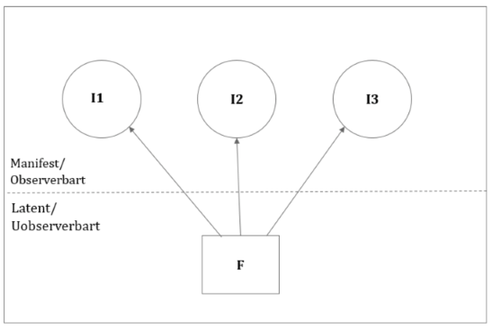

```{r echo=FALSE}

pacman:: p_load(dplyr, tidyverse, xaringanthemer,xaringanExtra, haven, paran, knitr, rayshader, av, psych, factoextra, usethis, stargazer)


setwd("C:/Users/mmn/ROCKWOOL Foundation Dropbox/Mikkeline Munk Nielsen/Nyere statistiske analysestrategier F23/slides-mmn/NSA23")

#xaringan::inf_mr()

xaringanExtra::use_xaringan_extra(c("tile_view", "tachyons"))
xaringanExtra::use_panelset()


xaringanExtra::use_logo(
  image_url = "https://designguide.ku.dk/download/co-branding/ku_co_uk_h.jpg",
  width = "220px",
  height = "256px",
)


style_mono_light(base_color = "#8B0000")

style_mono_accent(
  base_color = "#8B0000",
  header_color = "#8B0000",
  text_font_size = "1.2rem" 
)


```

# Program for i dag

- Recap

- Forudsagte factor scores og videre analyser

- Masser af øvelser! Øvelse i at gennemføre PCA fra start til slut, så vi er godt forberedte på eksamen.

- Oplæg fra Asger omkring brug af PCA i forbindelse med hans BA projekt

- Oplæg: hvordan kunne en PCA se ud til eksamen?

---
# Recap

De sidste par gange har vi lært at...
--

- PCA er en statistisk metode, der man kan reducere ”mange variable” til ”få grundlæggende variable” som opsummerer den fælles variation i de ”mange variable”.

--

- Det gør metoden særdeles praktisk til at måle et svært observerbare/latente fænomener eller begreber, fx en grundholdning, tillid, personlighed.

--

- Kan hjælpe med at undersøge om et fænomen/begreb er en- eller flerdimensionelt


---
# Recap

.pull-left[

]

.pull-right[
- Helt konkret kan PCA altså hjælpe os med at lave skalaer, der måler nogle af de sociale fænomener, som er vanskelige at observere direkte! 

- Sagt på en anden måde kan vi nemlig observere disse fænomener indirekte ved at lave nye variable, der opsummerer det, som en række manifeste variable har tilfælles.
]

---
# PCA trin for trin


**1)** Udvælg manifeste variable, som relaterer sig til det fænomen, som I er interesserede i at undersøge (operationalisering)

--

**2)** Vurdér de manifeste variables samvariation - undersøg deres korrelationsmatrice og vurdér dens faktorabiliet. Korrelerer varaiblene nok til, at vi med rimelighed kan antage, at de måler det samme?

--

**3)** Kør en pca i R ved at bruge **`prcomp()`** - denne kommando dekomponerer korrelationsmatricen for jer og danner nye komponenter/variable

--

**4)** Beslut hvor mange komponenter, det er meningsfuldt at beholde (vi vil jo gerne nedbringe antallet af variable til nogle få, der opsummerer de gamle)

--

**5)** Fortolk indholdet i de komponenter I har beholdt ved at analysere på hver komponents factor loadings. Vi roterer altid factor loadings for at lette fortolkningen, så vi bedre kan skelne mellem komponenterne.

--

**6)** Udtræk jeres nye variable og brug dem i analyser, som I plejer (temaet i dag)

---
# PCA trin for trin

** Trin 1: Udvælg manifeste variable**

Operationaliseringen består i at vælge variable, der relaterer sig til det givne fænomen (her tillid). Disse er fra European Social survey:


**1** `parliament = Trust in parliament`, 

**2** `legal_system = Trust in the legal system` 

**3** `police = Trust in the police`

**4** `politicians = Trust in politicians`

**5** `parties = Trust in parties` 

.pull-right[
*Skala: 0 (no trust at all) - 10 (complete trust)*
]


---
# PCA trin for trin

**2) Vurdér de manifeste variables samvariation** 

Undersøg deres korrelationsmatrice og vurdér dens ***faktorabiliet***. Korrelerer varaiblene nok til, at vi med rimelighed kan antage, at de måler det samme?


```{r, include=FALSE}

# Read dataset (for now as dta file, which Haven can help with)

ESS_DK <- read_dta("C:/Users/mmn/ROCKWOOL Foundation Dropbox/Mikkeline Munk Nielsen/Nyere statistiske analysestrategier F23/slides-mmn/NSA23/ESS6DK.dta")

ESS_DK <- ESS_DK %>%
  zap_labels() %>% 
  transmute(
    #Openness indicators (coding missing values):
    parliament = if_else(trstprl %in% c(88:99), NA_real_, trstprl),
    legal_system = if_else(trstlgl %in% c(88:99), NA_real_, trstlgl),
    police = if_else(trstplc %in% c(88:99), NA_real_, trstplc),
    politicians = if_else(trstplt %in% c(88:99), NA_real_, trstplt),
    parties = if_else(trstprt %in% c(88:99), NA_real_, trstprt),

    #Education variables:
    edu = case_when(
      edulvlb %in% c(8888:9999) ~ NA_real_,
      edulvlb %in% c(0:600) ~ 0,
      TRUE ~ 0,
      edulvlb %in% c(601:801) ~ 1,
      TRUE ~ 1)) %>%
  #Restricting sample to non-missing:
  drop_na


matrice <- ESS_DK %>% dplyr::select(parliament, legal_system, police, politicians, parties)

```
Vi kan start med at undersøge korrelationsmatricen:
```{r echo=FALSE}

(ESS_DK %>% 
    dplyr::select(parliament, legal_system, police, politicians, 
                  parties) %>% 
    cor())


```
---
# PCA trin for trin

**2) Vurdér de manifeste variables samvariation** 

*KMO-test*
```{r echo=FALSE, message=FALSE, warning=FALSE}
KMO(matrice) # KMO funktion
```
*Bartletts sfæriske test*
```{r echo=FALSE, message=FALSE, warning=FALSE}
cortest.bartlett(matrice, n=1406) # KMO funktion, argument n= antal observationer
```
---
# PCA trin for trin

**3) Kør en pca i R ved at bruge** **`prcomp()`**

***1) egenvektorer*** 
```{r echo=FALSE}
(pca <- (ESS_DK %>% 
          dplyr::select(parliament, legal_system, police, politicians, 
                  parties) %>% 
          prcomp(center=TRUE, scale=TRUE)))

```
***2) egenværdier (sdev^2)***
```{r, echo=TRUE}
(pca$eigen_values <- pca$sdev^2)
```
---
# PCA trin for trin

**4) Beslut hvor mange komponenter, det er meningsfuldt at beholde**

.pull-left[
**a)** Egenværdier > 1 (Kaiser-Guttman kriteriet).

**b)** Cattell’s scree test (scree plot).

**c)** Parallel analysis (de facto standard i dag).
]

.pull-right[
.center[

]
]

---
# PCA trin for trin

**5)** Fortolk indholdet i de komponenter I har beholdt med *factor loadings*

```{r echo=TRUE}
(pca$factor_loadings <- pca$rotation*t(matrix(rep(sqrt(pca$eigen_val),5),nrow=5,ncol=5))
) # Læg mærke til at jeg har specificeret matricens dimensioner (5x5) 
```


- Factor loadings er korrelationen mellem de manifeste variable og de udledte komponenter. 

- Vi fortolker de nye komponenter ved at undersøge, hvilke af de manifeste variable komponenter har "høje loadings" på

- Det kan dog være vanskelige at skelne mellem komponenterne på rå faktor loadings. Derfor roterer vi dem!


---
# PCA trin for trin

**5) Fortolk indholdet i de komponenter I har beholdt med factor loadings**

*For at lette fortolkningen og lettere kunne skelne mellem komponenter roterer vi factor loadings for at opnå "simple structure".* 


Vi bruger enten orthogonal (vinkelret) rotation:
```{r echo = T, results = 'hide'}
varimax(pca$factor_loadings[,1:2])
```

Eller oblique, som tillader komopnenter at korrelere
```{r echo = T, results = 'hide'}
Promax(pca$factor_loadings[,1:2])
```

---
# Rotation og simple structure

.center[
```{r, echo = FALSE, out.width='85%'}

```
.center[.backgrnote[*af Jonas Strøyberg Jensen*]]
]

---
# PCA trin for trin

**6) Udtræk jeres nye variable og brug dem i analyser (temaet i dag)**


```{r, include=FALSE}

# Read dataset (for now as dta file, which Haven can help with)

ESS_DK <- read_dta("C:/Users/mmn/ROCKWOOL Foundation Dropbox/Mikkeline Munk Nielsen/Nyere statistiske analysestrategier F23/slides-mmn/NSA23/ESS6DK.dta")

data <- ESS_DK %>%
  zap_labels() %>% 
  transmute(
    #Openness indicators (coding missing values):
    parliament = if_else(trstprl %in% c(88:99), NA_real_, trstprl),
    legal_system = if_else(trstlgl %in% c(88:99), NA_real_, trstlgl),
    police = if_else(trstplc %in% c(88:99), NA_real_, trstplc),
    politicians = if_else(trstplt %in% c(88:99), NA_real_, trstplt),
    parties = if_else(trstprt %in% c(88:99), NA_real_, trstprt),

    #Education variables:
    edu = case_when(
      edulvlb %in% c(8888:9999) ~ NA_real_,
      edulvlb %in% c(0:600) ~ 0,
      TRUE ~ 0,
      edulvlb %in% c(601:801) ~ 1,
      TRUE ~ 1)) %>%
  #Restricting sample to non-missing:
  drop_na()


var <- data %>% 
  dplyr::select(parliament, legal_system, police, politicians, 
                  parties)


pca <- prcomp(var, center = TRUE, scale = TRUE)


pca$eigen_values <- pca$sdev^2
pca$factor_loadings <- pca$rotation*t(matrix(rep(sqrt(pca$eigen_val),5),nrow=5,ncol=5))


#7: Rotate 5-dimension solution with promax (oblique)
pca_obli <- Promax(pca$factor_loadings[,1:2]) 


#Save structure matrix (the matrix product of the pattern loadings and the correlations):
pca_obli$structure <- pca_obli$loadings %*% pca_obli$Phi
colnames(pca_obli$structure) <- c("PC1", "PC2")

```

Når man har afsluttet sin PCA og nået frem til fortolkelige komponenter, så kan man arbejde videre med disse komponenter. På baggrund af en PCA kan man nemlig få komponenterne ud som nye variable!


.pull-right[]


--
.pull-left[

$\rightarrow$ For at udtrække komponenterne udregner vi *forudsagte factor scores*, dvs. hver observations placering på den/de nye skala(er)
]

---
# Forudsagte factor scores

Der findes forskellige måder at genere factor scores som variable i sit datasæt. Vi bruger ”regressionsmetoden”, som er default i psych-pakken:

```{r echo = T, results = 'hide'}

# Predict values for each respondent on the (rotated) components with 
# factor.scores() from the psych-package:
pred <- factor.scores(var, pca_obli$loadings)

# Add these predictions to your data:
data <- bind_cols(data, pred$scores)

```


Her bruger man principperne i lineær regression til ”back out” vægtene for hver indikator.

---
# Forudsagte factor scores

Den skala PCA producerer er ikke sammenlignelig med den originale skala på de manifeste variable. Derfor er det standardpraksis at standardisere de variable, som man udleder af PCA. Bemærk at psych automatisk standardiserer factor scores til en middelværdi på 0 og sd på 1. Det betyder, at de nye variables skalaer er i standardafvigelser! 
```{r echo = T}
describe(data$PC1)
```
--

Det betyder, at en stigning på 1 = en stiging på 1 standardafvigelse.

--

*Det er ikke alle programmer/pakker der gør det, så det kan godt betale sig at være opmærksom på, at man nogle gange selv skal standardisere.*


--

**Nu er I klar til at bruge jeres nye variable i analyser!**


---
# Opsummering

Vi har været igennem følgende trin nu

**1)** Vurdere om korrelationsmatricen er faktorabel 

--

**2)** Køre en pca og bestemme, hvor mange komponenter vi beholder

--

**3)** Udregne og rotere factor loadings for at fortolke komponenterne

--

**4)** Udtrække forudsagte factor scores til videre analyse

---
# Program for resten af dagen:

Pause

--

- Arbejde videre med øvelse 1 "Børn er forskellige"
--

Pause

--

- Lave en PCA fra start til slut. Her kan i vælge imellem:

  + Tolerance, please!

  + Hvis din nabo var en...
  
  + Åbenhed
  

--

Pause(r)

--

- Oplæg fra Asger om hans brug af PCA i BA projekt!

--

- Hvordan kunne en PCA opgave se ud til eksamen?

---
# Hvordan kunne en PCA-opgave se ud?

.pull-left[
**LCA** gruppérer **personer** i nogle få grundlæggende *typer/klasser* 
<break>


- Hvilke typer af...
- Hvor mange typer af...
- Hvad karakteriserer disse typer...
]

--
.pull-right[
**PCA** grupperer **variable** der måler det samme og omgrupperer dem til variable/skalaer, der opsummerer variationen på tværs af de gamle variable


- Danner skalaer for svært observerbare fænomener
- Tænk kontinuert
- Er der nationale/sociale/demografiske forskelle i...

]


---
# Hvordan kunne en PCA-opgave se ud?

***Eksempel på spørgsmål:*** Er der nationale forskelle i institutionel tillid?

--

**1)** Operationalisering: Hvilke spørgsmål måler institutionel tillid?

--

**2** Argumenter for brugen af PCA: Tillid er svært at observere og måle direkte med en enkel variabel. PCA kan hjælpe os med at skabe nye variable, der opsummerer den fælles variation på tværs af vores udvalgte variable. Samtidig kan vi bruge metoden til at vurdere, om der er flere dimensioner på spil og trække de relevante ud!

--

- Redegør for de overordnede principper i PCA i generelle termer. Orienter jer f.eks. i Kline 1994:kap.1+3

--

- I skal ikke udlede noget i hånden eller gå ind i matematikken. I skal bare redegøre for de grundlæggende principper i, at PCA kan udlede nye komponenter ved at dekomponere en korrelationsmatrice og beskrive overordnet, hvordan den går til værks.


---
# Hvordan kunne en PCA-opgave se ud?

**3) Undersøg samvariationen mellem jeres variable - er korrelationsmatricen faktorabel?**

--

Redergør for og sammenlign de tre kriterier:

- Hver indikatorvariabel i en korrelationsmatrice skal have mindst en korrelation på over 0,3 (Hansen 2017)

- Kaiser-Meyer-Olkin test (KMO)

- Bartlett’s (sfæriske) test

Dette er tre metoder, der kan hjælpe jer med at vurdere, om der er empirisk grundlag for at antage, at jeres manifeste variable måler det samme latente fænomen.

--

*Men husk at bruge dem heuristisk - jeres teoretiske argumenter skal også informere jeres valg*

---
# Hvordan kunne en PCA-opgave se ud?

**4) Kør PCA og bestem antal komponenter**

--

Argumenter for jeres valg på baggrund af de tre kriterier (og beskriv logikken bag dem):

- Egenværdier > 1 (Kaiser-Guttman kriteriet).

- Cattell’s scree test (scree plot).

- Parallel analysis (de facto standard i dag).

--

Der er en lærings- og pensummæssig pointe i at sammenligne de tre metoder, men parallelanalysen er standard procedure i dag. 

--

Hvis I stadig er i tvivl om, hvor mange komponenter, som I skal beholde, så prøv at gå videre med et par forskellige. I skal vælge det antal, som giver de mest meningsfulde komponenter, dvs. dem hvor I bedst kan skelne mellem dem, når I fortolker factor loadings. 

---
# Hvordan kunne en PCA-opgave se ud?

**5) Beskriv de komponenter, som I beholder**

--

- Udregn og roter factor loadings

- Beskriv hvorfor vi roterer og redegør for simple structure kriterierne (ex. Kline 1994:64 fl.)

- Argumenter for, hvilken rotationsmetode i foretrækker (orthogonal vs. oblique - forventer I at komponenterne vil korrelere?)

- Navngiv jeres komponenter meningsfuldt (f.eks. PC1 "Tillid til politiske institutioner" og PC2 "Tillid til retssystemet")


---
# Hvordan kunne en PCA-opgave se ud?


**6) Udregn forudsagte factor scores og brug variablen(e) i videre analyser**

--

- Husk at factor scores er standardiserede til middelværdi 0 og standardafvigelse 1. Komponenternes skala er altså i standardafvigelser!

- Det er oplagt at køre regressionsanalyse med jeres nye komponenter og finde ud af, om der f.eks. er nationale/socioøkonomiske/demografiske forskelle

--

*No need to overdo it og køre fuld IV-estimation eller RD. En simpel multipel regressionsanalyse er rigeligt. Læringsmålet i faget er LCA og PCA, ikke andre fancy metoder!*

---
# Ekstra huskeregler til PCA

- PCA kan ikke håndtere missingværdier (laver listwise deletion). Dvs. der må ikke være missing på nogle af jeres manifeste variable.

- Jeres manifeste variable skal som udgangspunkt have samme skala. Forestil jer at sammenligne DKK og Euro - hvad ville PCA vægte højest? Det kan dog fikses ved at aktivere "scale-argumentet" i **`prcomp()`** så variablene standardiseres på forhånd. Hold jer til disse specifikationer:

```{r echo = T}
pca <- prcomp(var, center = TRUE, scale = TRUE)
```

- Hvis jeres komponenter ender med at loade negativt så I får en skala, der f.eks. måler *mistillid* fremfor *tillid* kan I vende skalaen:

```{r echo = T}
data$PC1 <-data$PC1*-1
```
... det svarer bare til at ændre fortegnet og har kun fortolkningsmæssig betydning. 


