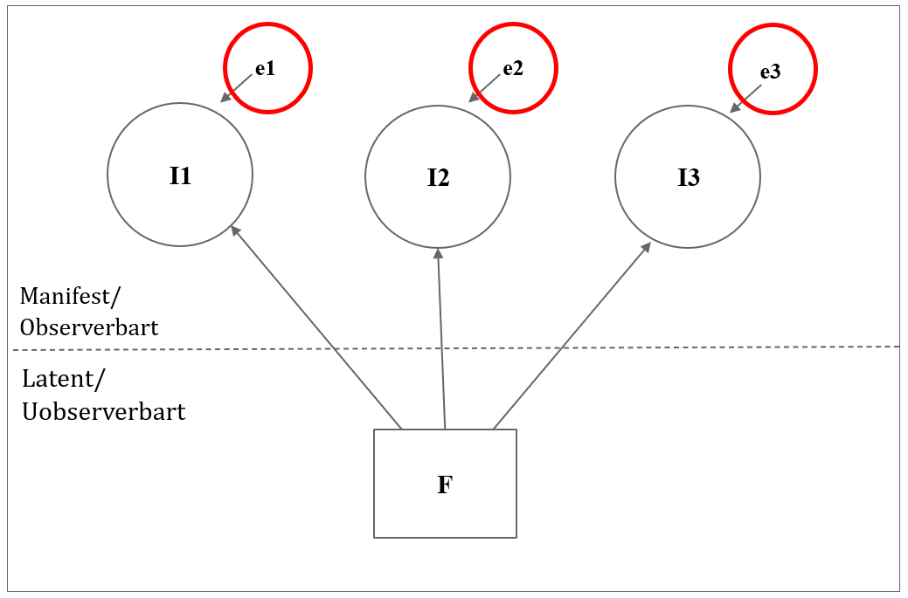

```{r echo=FALSE}

pacman:: p_load(dplyr, tidyverse, xaringanthemer,xaringanExtra, haven, paran, knitr, rayshader, av, psych, factoextra, usethis, stargazer, ltm)


setwd("C:/Users/mmn/ROCKWOOL Foundation Dropbox/Mikkeline Munk Nielsen/Nyere statistiske analysestrategier F23/slides-mmn/NSA23")

#xaringan::inf_mr()

xaringanExtra::use_xaringan_extra(c("tile_view", "tachyons"))
xaringanExtra::use_panelset()


xaringanExtra::use_logo(
  image_url = "https://designguide.ku.dk/download/co-branding/ku_co_uk_h.jpg",
  width = "220px",
  height = "256px",
)


style_mono_light(base_color = "#8B0000")

style_mono_accent(
  base_color = "#8B0000",
  header_color = "#8B0000",
  text_font_size = "1.2rem" 
)


```

# Program for i dag

Videregående eksplorativ PCA

- Commen factor model: factors vs. components

pause

- PCA med ikke-kontinuerte items

- Chronbachs alpha

pause

- workshop med eksamensdata

---
# Common factor model

I PCA har vi udledt komponenter (*principal components*), men det er vigtigt at være opmærksom på, at litteraturen skelner mellem *faktorer* og *komponenter*


- **Komponenter** er resultatet af en iterativ statistisk metode (PCA), der dekomponerer en korrelationsmatrix.


- **Faktorer** er hypotetiske konstrukter ”out there”, som vi forsøger at måle (CFM)


Pett et al. + Hansen (2017) laver denne skelnen.

---
# Common factor model


”Common factor model” referer til den klasse af EFA, som arbejder med faktorer.


- Den centrale forskel på CFM og PCA er, at CFM antager, at der er ”målefejl” i vores data.


- Klassen af CFM-modeller forsøger dermed eksplicit at korrigere for målefejlen.


Med målefejl mener vi her det faktum, at de latente faktorer ikke kan forklare al variation i korrelationsmatricen. Det virker jo yderst rimeligt!

PCA, derimod, ”antager”, at man kan forklare al variation, også den, der opstår pga. målefejl eller sampling støj.

---
# Common factor model

.center[
```{r, out.width = "750px", echo=FALSE}

```
]

---
# Common factor model

.center[
```{r, out.width = "750px", echo=FALSE}

```
]

---
# Common factor model

CFM deler variansen i en korrelationsmatrice op i tre dele:

**1** Common variance: Andelen af variansen, der kan forklares af faktorer


**2** Specific variance: Den varians som vedrører en enkelt indikator (fx hvis indikatoren er en dårlig indikator).


**3** Error variance: Tilfældige målefejl (ved den enkelte indikator).


---
# Common factor model

*I PCA skelner man ikke mellem specific variance og error variance!*


- Specific og error variance udgør tilsammen, det man kalder den *unikke varians* (der er defineret som communality minus 1), men terminologien er mindre væsentlig her.


- Unik varians er den varians, som ikke kan forklares af faktorer så at sige.

---
# Common factor model

Der findes flere CFM metoder - den primære er dog *principal factoring* eller *principal axis factoring*. 

- **Princip:** Principal factoring forsøger at “tage målefejlen i korrelationsmatricen ud” og så køre en PCA på den opdaterede matrix.

- **Praksis:** Konkret erstatter man diagonalen i korrelationsmatricen med estimater af communality, som kan estimeres på flere måder…

Communality er defineret som 1 minus uniqueness, men terminologien er mindre vigtig her.

---
# Common factor model

```{r, include=FALSE}

# Read dataset (for now as dta file, which Haven can help with)

ESS_DK <- read_dta("C:/Users/mmn/ROCKWOOL Foundation Dropbox/Mikkeline Munk Nielsen/Nyere statistiske analysestrategier F23/slides-mmn/NSA23/ESS6DK.dta")

ESS_DK <- ESS_DK %>%
  zap_labels() %>% 
  transmute(
    #Openness indicators (coding missing values):
    parliament = if_else(trstprl %in% c(88:99), NA_real_, trstprl),
    legal_system = if_else(trstlgl %in% c(88:99), NA_real_, trstlgl),
    police = if_else(trstplc %in% c(88:99), NA_real_, trstplc),
    politicians = if_else(trstplt %in% c(88:99), NA_real_, trstplt),
    parties = if_else(trstprt %in% c(88:99), NA_real_, trstprt),

    #Education variables:
    edu = case_when(
      edulvlb %in% c(8888:9999) ~ NA_real_,
      edulvlb %in% c(0:600) ~ 0,
      TRUE ~ 0,
      edulvlb %in% c(601:801) ~ 1,
      TRUE ~ 1)) %>%
  #Restricting sample to non-missing:
  drop_na()

```
Her er den korrelationsmatrice, som vi har kigget på som eksempel i undervisningen:
```{r echo=FALSE}

(ESS_DK %>% 
    dplyr::select(parliament, legal_system, police, politicians, 
                  parties) %>% 
    cor())


```

--

Her vil I lægge mærke til, at diagonalen har alle værdien 1 (dvs. communality = 1)

--

Pointen i CFM er, at estimaterne af communality skal gerne afspejle målefejlen...

---
# Common factor model

Den mest udbredte metode er at bruge squared multiple correlations ( $R^2$ ) fra regressioner af hver indikator variabel på alle andre indikatorvariable.

.pull-left[
Squared multiple correlations er som estimat den nedre grænse for communality, dvs. det er i teorien et bud på målefejlens maksimale betydning.


En udvidelse er såkaldt iterated principal factoring.
Metoden starter på samme vis som principal factoring, men her opdaterer man løbende communalities med estimater, der fitter bedre.
Er i princippet at foretrække, men kan ikke altid ”konvergere” (Heywood case).
]

.pull-right[

```{r, echo = FALSE, out.width='100%'}
knitr::include_graphics('https://vitalflux.com/wp-content/uploads/2019/07/R-squared-formula-linear-regression-model.jpg')
```
]

---
# Common factor model

- Kline (1994) citerer en kilde, som viser, at PCA og CFM ofte vil give samme resultat, når der er mange indikatorer.

- Intuitionen må være, at med mange indikatorer er den gennemsnitlige målefejl lav (altså, det er godt med mange målinger af det samme).

---
# Polychorisk PCA


Polykorisk PCA er en udvidelse (eller måske rettere en *specificering*) af PCA, som I kender den. 

- PCA antager i udgangspunktet, at indikatorvariable er kontinuerte (eller intervalskalerede).

- Men vi arbejder ofte med binære eller ordinale (Likert-type) indikatorer i sociologien…


```{r, echo = FALSE, out.width='100%'}

```

.center[***What to do?***]

---
# Polykorisk PCA

- ”Løsningen” er at bruge en anden form for korrelationskoefficient end Pearson’s product-moment correlation.

-  Korrelationer kendes som tetrakoriske (for binære variable) og polykoriske (for ordinale variable).

--

Antagelsen bag den polykoriske korrelation er, at der nedenunder den dikotome eller ordinale indikator ligger en kontinuert variabel.

Vi kan ikke se denne kontinuerte variabel, men ved hjælp af statistiske regler kan man udregne korrelationen mellem de variabler, der ligger nedenunder de diskrete variable.


---
# Polychorisk PCA

- For de nørdede: Har man både kontinuerte og diskrete indikatorvariable, så kan man også nemt håndtere det.
I så fald snakker man om polyserielle korrelationer

--

- I praksis er forskellen bare, at PCA'en vil køre en normal PCA på en korrelationsmatrice med *polykoriske korrelationer. *

--


**OBS! Man skal ikke gøre dette til eksamen**, men det er vigtigt at vide, at polykoriske korrelationer i princippet er ”mere rigtigt”. I praksis er forskellen bare, at PCA'en vil køre en normal PCA på en korrelationsmatrice med *polykoriske korrelationer. *

--

*Hvis man har lyst til at prøve kræfter med en polykorisk PCA ligger der en øvelse med en egnet R-pakke på absalon*

---
# Chronbachs alpha

Chronbachs alpha er et mål man bruger til at vurdere en sumskalas såkaldte interne reliabilitet, dvs. et mål for, hvor meget målefejl, der er i ens skala.

Alfa måler ikke dimensionalitet eller validitet, men reliabilitet, forudsat at der er én dimension i items.


---
# Chronbachs alpha
```{r echo=T}

(ESS_DK %>% 
    dplyr::select(parliament, legal_system, police, politicians, 
                  parties) %>% 
    cronbach.alpha())
```
.pull-left[
Vi fortolker alpha-værdien ud fra følgende:
]
.pull-right[
```{r, echo = FALSE, out.width='75%'}

```
]
